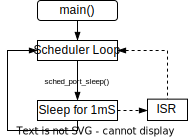
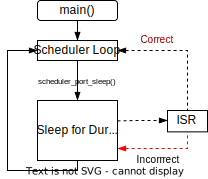

# Mandatory Platform Port Functions

A handful of platform-specific functions must be implemented in order to 
utilize the scheduler with a new processor type.   These functions are all 
declared in the `sched_port.h` header file.  Example implementations are 
provided in the project `.\examples\` folder which can serve as a starting 
point for porting to a new platform.

## Que Lock Functions

`void sched_port_lock(void)`
`void sched_port_free(void)`

These functions are used for acquiring exclusive access to the scheduler's 
linked list task que.  The functions are called by the scheduler whenever the
scheduler needs to modify the task que.  The lock prevents different sections 
of code from modifying the task que pointers at the same time, which could 
lead to corruption of the que.  One example of this is a higher priority 
interrupt preempting a lower priority interrupt with both attempting to add 
tasks. 

Exclusive access can typically be achieved by either temporarily disabling 
global interrupts or by utilizing a mutex lock.  The `sched_port_que_unlock()` 
function will always be called after the `sched_port_lock()` function once the 
que modifications have been completed.

## Millisecond Timer Function

`uint32_t sched_port_ms(void)`

The scheduler requires a  mS timer to accurately time tasks. The 
`sched_port_ms()` must return the current value of the timer value in units of 
milliseconds (mS). The timer must be monatomic.  It must increment one time for 
each mS of real time after initialization with no discontinuities or jumps.  It 
is expected to roll back to 0 after the UINT32_MAX value.  Once the scheduler 
has been started, the counter should only be modified by to the normal mS 
increment behavior.  More details on how the scheduler handles calculating 
task intervals and determines task expiration can be found in the 
[Tick Timer](tick_timer.md) section.

Some sleep strategies may stop the timer during the platform sleep function 
call.  This technique is sometimes referred to as tickless timer mode.   This 
approach is acceptable provided that the timer's counter is corrected for the 
actual duration that it was asleep and restarted before the sleep function 
returns.  

# Optional Platform Port Functions

Several additional functions can optionally be implemented by the user to 
further customize scheduler operation and handle an platform-specific 
requirements.  These functions are defined as weak inside of the scheduler 
module and therefore do not require user definition if they are not utilized.

## Port Initializer Function

`void sched_port_init(void)`

The function is called by the scheduler module during startup to initialize 
any platform-specific resources required by the scheduler.  The mS timer would 
typically be configured here if not previously setup.

## Port Deinitializer Function
`void sched_port_deinit(void)`

The function is called by the scheduler during its stop sequence to perform any 
platform-specific deinitialization and tear down.  Any resources initialized by 
'sched_port_init()' should be deinitialized here.  

## Port Sleep Function

`void sched_port_sleep(uint32_t interval_ms)`

The sleep function can be used to configure the platform for its lowest power 
consumption mode during periods of inactivity.  A variety of different sleep 
techniques can be implemented depending on the sleep hardware supported by the 
platform.   When porting to a new platform, it may be helpful to postpone 
implementation of the sleep function until the rest of the port has been 
completed. Several simple sleep implementations are presented below but they 
most likely do not represent the lowest power option available.

### Busy Wait Sleep

The simplest sleep implementation for sched_port_sleep() is no implementation 
since the function is optional.  If no user implementation is supplied, the 
scheduler will busy-wait between tasks.  This implementation offers no power 
savings but this may be an entirely acceptable solution for initial testing 
or for systems which aren't concerned with power consumption.

### Fixed Duration Sleep

 

A simple sleep implementation is to always sleep for a short fixed duration 
regardless of the interval supplied at function call. For example, the sleep 
function might always sleep for 1 mS before returning.  The fixed sleep 
duration could be increased to 5 or 10 mS if the application can tolerate a 
larger jitter in the task interval execution.  This may not be the lowest 
power solution for an application which uses a longer task intervals but it 
is typically simple to implement.

<br clear="right"/>

```
void sched_port_sleep(uint32_t interval_ms) {
    sleep_1ms();       // Sleep for 1 mS
}
```

### Systick Timer Sleep Wake

It is typical for many platforms to have a timer dedicated to generating 
interrupts every 1 mS to increment a systick timer.  In this case, the sleep 
function may be able to utilize a WFI (Wait for Interrupt) instruction.   This 
would be a common approach on an ARM processor.

```
void sched_port_sleep(uint32_t interval_ms) {
    WFI();       // Sleep until the next interrupt occurs
}
```

### Complex Sleep Implementations

In many cases, power consumption can be significantly reduced by implementing 
a more complex sleep technique which utilizes the platform's sleep 
hardware.  All sleep implementations must take care to meet the following 
requirements:

1. The platform must wake itself and return from the sched_port_sleep() 
function call at or before the supplied interval.  Since the scheduler caches 
the next expiring task, there is minimal overhead introduced by the sleep 
function returning early if needed.  This might be the case for a system with 
an 8-bit sleep timer as an example.  If the requested interval exceeds the 
maximum sleep interval supported by the platform's sleep timer, the platform 
can simply sleep for as long as it can before returning.

2. The mS timer, as returned by the sched_port_ms() function, must be be valid 
on return from the function.  If the mS timer was stopped during the sleep 
interval, the timer must be corrected and restarted before the sleep function 
returns.

 

3. Support for adding or modifying tasks from a interrupt contexts imposes 
one additional requirement. If the platform is woken from sleep due to an 
interrupt, the sleep function must return once the interrupt has been serviced 
even if the sleep interval hasn't expired.   A new task may have been started 
inside of the ISR and it could potentially expire before the previously 
commanded sleep interval does.  The sleep function must return after the ISR 
completes to ensure that the new task is serviced.  
<br clear="right"/>


