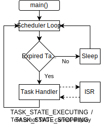
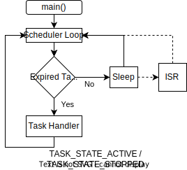

#  Task States

## Task States

Each task includes a variable to track it's current state.  The state tracking is used to control access to the task preventing the task from being modified in a way that might corrupt it.  The task can be in one of five different states at any given time:

* TASK_STATE_UNINIT: The task has not be initialized yet.  The state is primarily used to track if the task has been added to the Scheduler's task que.  Once the configuration function has been called, a task does not return to this state until the scheduler is stopped.

* TASK_STATE_STOPPED: The task has been added to the task que but isn't currently active.   All task configuration options are available in this state.  The task moves to the active state once the start function is called.

* TASK_STATE_ACTIVE: The task has been started and it's handler function will be called once it's timer interval expires but the handler is not currently executing.

* TASK_STATE_EXECUTING: The task's handler function is currently executing.  

* TASK_STATE_STOPPING: The task stop function was called while its handler was executing.  The task will move to the stopped stated once the handler function returns.

## Task State Interrupts

The [cooperative multitasking](https://en.wikipedia.org/wiki/Cooperative_multitasking) system implemented by the scheduler significantly reduces the challenge of task access control versus a more complex preemptive multitasking system.  Only one scheduler task handler can run at any given time. Each task handler runs until it completes once started. Task handler execution can only be paused due to an interrupt event as shown in the diagram below.

### Interrupt Inside a Task Handler

<table align="center">
    <tr>
        <td align="center" valign="top" style="width:40%"></td>
        <td align="left" valign="top">A task and its data can be modified, inside of an ISR without risk of task corruption.  The following diagram shows another possible interrupt scenario.  The processor is woken from sleep by an interrupt.  Once the ISR completes, the scheduler operation resumes.</td>
    </tr>
</table>

### Interrupt from Sleep

<table align="center">
    <tr>
        <td align="center" valign="top" style="width:40%"></td>
        <td align="left" valign="top">A task and its data can be modified, inside of an ISR without risk of task corruption.  The following diagram shows another possible interrupt scenario.  The processor is woken from sleep by an interrupt.  Once the ISR completes, the scheduler operation resumes.</td>
    </tr>
</table>

## Access Control

Task write access is limited depending the task's current state as shown in the following table.  Although only one task is ever active active at any given time, a interrupt can both pause the task handler execution and wake the processor from sleep.  The access protection prevents an ISR from modifying an active task.     

| Task State        |Task Config  | Task Start   | Task Stop  | Interval Set    | Data Write  |
| :----             |   :----:    |  :----:      |  :----:    |      :----:     |    :----:   |
| STATE_UNINIT      | &#x26AB;    |              |            |                 |             | 
| STATE_STOPPED     | &#x26AB;    | &#x26AB;     | &#x26AB;   | &#x26AB;        | &#x26AB;    | 
| STATE_ACTIVE      | &#x24F5;    | &#x24F6;     | &#x26AB;   | &#x24F5;        |             | 
| STATE_EXECUTING   |             | &#x24F6;     | &#x24F7;   |                 |             | 
| STATE_STOPPING    |             | &#x24F6;     | &#x24F7;   |                 |             | 

TODO need a better name for stopping which indiates its executing but the stop is qued.

The user needs to be able to update the interval, start and stop tasks inside of the handler.

Should they be able to change the handler?

I think the data needs to be locked else an ISR might change the data.

It should be ok to update the interval whenever.  If the handler   

Task State Notes:

1. Calls to task config or interval update function will automatically stop a task if it is currently active before updating the task configuration.

2. Attempts to start an already started task are simply ignored and do not generate a user error.

3. Calling the stop function on an executing or already stopping task do not happen immediately.  The task's handler must be return before the stop can complete so the stop request is is stored by moving to the stopping state.  The task's stop will complete once the handler returns.

## User Limitations

From a user prospective, the access control presents two limitations. 

* A task should be stopped before its configuration or data is updated.  Note that non-repeating tasks stop automatically once executed.
* A task will not stop immediately if a stop is attempted while executing the task handler. 

