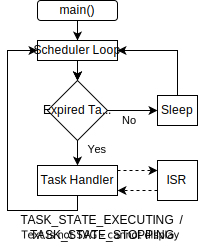

#  Task State & Access Control

## Overview

Each task tracks its current state with a state variable.  The state tracking 
is primarily used to control access to the task's configuration and data.  The
mechanism protects a task from being modified in a way which could corrupt it. 

## Task States

Each task can be in one of the following states at any given time:

* SCHED_TASK_UNINIT: The task has not be initialized yet.  The state is 
primarily used to track if the task has been added to the scheduler's task 
que.  Once the configuration function has been called, a task does not return 
to this state until the scheduler stops.

* SCHED_TASK_STOPPED: The task has been added to the task que but the task 
is not currently active.  The task moves to the active state after the start 
function is called.

* SCHED_TASK_ACTIVE: The task has been started and the handler is not currently
active.  The task's handler will be called once its timer interval expires.

* SCHED_TASK_EXECUTING: The task timer expired and its handler function is 
currently executing.  

* SCHED_TASK_STOPPING: The task's handler is currently executing and the task 
will be stopped once the handler returns.  A non-repeating task will be placed 
into this state during handler execution.  A task can also enter this state 
if the `sched_task_stop()` function is called during handler execution since it
 can not be stopped until the handler function returns.

## Interrupts

A non-preemptive cooperative task scheduler significantly reduces the challenge 
of implementing task access control in comparison to a more preemptive 
multitasking system.  Only one task handler will ever be active at any given 
time. Once started, each task handler runs until completion and the task 
handler's execution can only be suspended due to an interrupt or other 
exception event.  The flow charts below shows the scheduler's program flow 
for interrupt events for each of the different scheduler states.

### Interrupt from Sleep

The diagram shows the processor being woken from sleep by an interrupt 
event.  Once the ISR associated with the interrupt completes, the scheduler 
checks for task expiration.  After handling any tasks with expired timers, the 
scheduler puts the processor back to sleep.
 

### Interrupt Inside a Task Handler

The diagram shows an interrupt or exception event happening during task handler 
execution.  The ISR can not modify the currently executing task's data without 
risk of corrupting the handler's operation. 

 

### Nested Interrupts

The flow chart shows higher priority interrupt event occurring while the 
processor was executing an ISR as a result of a different interrupt. This can 
only happen on a platform which supports nested interrupts, which many modern 
processors do.  A nested interrupt has the same access restrictions as a 
single interrupt.
 

Note that an interrupt is just one of the several types of exceptions which a 
particular platform may support.   A variety of different hardware events 
including memory access, timer expiration, reset and hardware interrupts can 
generate processor exception events.  Each type of exception typically has its 
own handler which is triggered by the exception event.  In the case of interrupts, 
the exception handler is known as an ISR (Interrupt Service Routine).  The flow 
charts above only show interrupt events impeding the task handler flow but any 
exception can do the same.    Interrupts are shown here because ISR's are 
generally user level code and exception handlers are generally system level 
code. Scheduler tasks would typically only be accessed inside an ISR and not 
in a system level exception handler. 

## Access Control by State

Access to a task is limited by the task's current state as summarized in the 
following table.  Although only one task handler can ever run at a given time, 
an interrupt can both suspend a task handler's execution and also wake the 
processor from sleep.  The scheduler's access protection mechanism prevents a 
task from being modified in a way which might corrupt the task or its 
data.   For example, setting an active task's data pointer to NULL inside of an 
ISR could lead to unpredictable operation if the task's handler was accessing 
the data pointer at the same time.

| Task State           | Task Config | Task Start | Task Stop | Interval Update | Data Update |
| :----                |    :----:   |   :----:   |  :----:   |     :----:      |    :----:   |
| SCHED_TASK_UNINIT    | &#9726;     |            |           |                 |             | 
| SCHED_TASK_STOPPED   | &#9726;     | &#9726;    | &#9726;   | &#9726;         | &#9726;     | 
| SCHED_TASK_ACTIVE    |             | &#9726;    | &#9726;   | &#9726;         |             | 
| SCHED_TASK_EXECUTING |             | &#9726;    | &#9726;   | &#9726;         |             | 
| SCHED_TASK_STOPPING  |             | &#9726;    | &#9726;   | &#9726;         |             | 

## Access Control Rationale

The reasoning for each the task state access control restriction is documented 
bel.ow.

* SCHED_TASK_UNINIT:
    * A task must be initialized with `sched_task_config()` function prior to 
    use. The function configures the task and adds it to the task que.
    * All other function calls on uninitialized tasks which can not be 
    completed and will return failed.

* SCHED_TASK_STOPPED:  
    * No access protection is required when the task is stopped.
    * Stopped is the only task state during which the task data reference can 
    be modified.  This restriction protects task data reference from being 
    modified from within an ISR while the task's handler is executing. Note 
    that only the data reference is protected, the value of the referenced 
    data can be modified.

* SCHED_TASK_ACTIVE:  
    * Calls to the interval set function, on a currently active task, stop the 
    task prior to updating it. 
    * Starting a task that's already in the SCHED_TASK_ACTIVE state updates the
    task's start time but has no other effect since the task is already active.
    
* SCHED_TASK_EXECUTING & SCHED_TASK_STOPPING:  
    * The executing and stopping states require the most access control 
    restrictions.  
    * The task's handler function has been called but has not returned yet in 
    both of these states.  Changing the task data reference could conflict with 
    the work being performed inside the task handler function.
    * Although it may be somewhat unintuitive at first consideration, a task's 
    interval can safely be updated in both of these states.   A task is checked 
    for interval expiration just prior to entering the SCHED_TASK_EXECUTING 
    state.  The task interval is not accessed by the scheduler while in either 
    of the SCHED_TASK_EXECUTING or SCHED_TASK_STOPPING states and can therefore 
    safely be updated.
    * A call to the task stop function on a currently executing task does not 
    happen immediately.  The task's handler function must return before the 
    task can stop.  The stop request is recorded changing the task to the 
    SCHED_TASK_STOPPING state. The task will move to the SCHED_TASK_STOPPED 
    state once its handler has returned.
    * A non-repeating task will switch to the SCHED_TASK_STOPPING state 
    prior to its handler function being called to indicate that it will be 
    stopped once the handler returns.  This gives the user the opportunity to 
    restart a task inside of the handler if needed.

