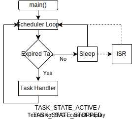

#  Task State

## Overview

Each task includes an internal variable to track the task's current state.  The state tracking is used to control access to the task's configuration and data.  This mechanism is required to prevent the task from being modified in a way which could corrupt its operation.  The state is variable is declared as volatile since it can be updated from an ISR context.

## State Descriptions

A task can be in one of the following states at any given time:

* TASK_STATE_UNINIT: The task has not be initialized yet.  The state is primarily used to track if the task has been added to the Scheduler's task que.  Once the configuration function has been called, a task does not return to this state until the scheduler is stopped.

* TASK_STATE_STOPPED: The task has been added to the task que but isn't currently active.   All task configuration options are available in this state.  The task moves to the active state once the start function is called.

* TASK_STATE_ACTIVE: The task has been started and it's handler function will be called once it's timer interval expires but the handler is not currently executing.

* TASK_STATE_EXECUTING: The task's handler function is currently executing.  

* TASK_STATE_STOPPING: The task stop function was called while its handler was executing.  The task will move to the stopped stated once the handler function returns.

## Interrupts

The [cooperative multitasking](https://en.wikipedia.org/wiki/Cooperative_multitasking) system utilized by the scheduler significantly reduces the challenge of implementing task access control versus a more complex preemptive multitasking system.  Only one task handler will be running at any given time. Each task handler runs until completion once started.  Handler execution can only be paused due to an interrupt event.  The flow charts below show the scheduler's program flow for interrupt events during different scheduler states.

### Interrupt Inside a Task Handler

<table align="center">
    <tr>
        <td align="center" valign="top" style="width:35%"></td>
        <td align="left" valign="top">The diagram shows an interrupt event happening while a task handler function is executing.  The ISR can not modify the task data without risk of corrupting with the handler's operation. </td>
    </tr>
</table>

### Interrupt from Sleep

<table align="center">
    <tr>
        <td align="center" valign="top" style="width:45%"></td>
        <td align="left" valign="top">The diagram shows the processor being woken from sleep by an interrupt event.  Once the ISR completes, the scheduler operation checks for expired tasks.  If there are no expired tasks, it puts the processor back to sleep.</td>
    </tr>
</table>

## Access Control by State

Access to a task is limited by the task's current state as summarized in the table below.  Although only one task's handler ever runs at any given time, a interrupt can both pause the task handler's execution and wake the processor from sleep.  The access protection mechanism prevents an ISR from modifying a task in way that might corrupt the task or its data.   

| Task State        |Task Config | Task Start | Task Stop | Interval Set | Data Write |
| :----             |   :----:   |   :----:   |  :----:   |   :----:     |   :----:   |
| STATE_UNINIT      | &#x26AB;   |            |           |              |            | 
| STATE_STOPPED     | &#x26AB;   | &#x26AB;   | &#x26AB;  | &#x26AB;     | &#x26AB;   | 
| STATE_ACTIVE      | &#x26AB;   | &#x26AB;   | &#x26AB;  | &#x26AB;     |            | 
| STATE_EXECUTING   |            | &#x26AB;   | &#x26AB;  | &#x26AB;     |            | 
| STATE_STOPPING    |            | &#x26AB;   | &#x26AB;  | &#x26AB;     |            | 

### Implementation Notes

* TASK_STATE_UNINIT:
    * A task must be initialized prior to use so only the config function is available in the uninitialized state.

* TASK_STATE_STOPPED:  
    * No access protection is required if the task is stopped.
    * This is the only state during which the task data can be updated.

* TASK_STATE_ACTIVE:  

    * Calls to the task config and interval set functions for an active task will automatically stop the task prior to updating it.  
    * Attempts to start an already started task are simply ignored.
    
* TASK_STATE_EXECUTING & TASK_STATE_STOPPING:  
    * The executing and stopping states require the most access control restrictions.  
    * The task's scheduler function has been called but has not returned yet in these states.  Any changes to the tasks data inside an ISR could conflict with the work being performed by the handler function.
    * Although it may be somewhat unintuitive on first consideration, the task's interval can safely be updated in either of these states.   A task's interval is checked for expiration just prior to entering the TASK_STATE_EXECUTING state and making the task handler function call so  there is no potential for a task interval access conflicts.
    * A call to the stop function on a currently executing task does not happen immediately.  The task's handler function must return before the task can stop.  The stop request is recorded by moving from the TASK_STATE_EXECUTING to the TASK_STATE_STOPPING state.  The task will move to the TASK_STATE_STOPPED state once the handler returns.
    * Non-repeating task will be placed into the TASK_STATE_STOPPING state prior to calling the task handler function to record that they will be stopped once the handler function returns.  This gives the user the opportunity to restart the task inside the handler.

## User Prospective

From the end user prospective, tasks have three basic requirements and access restrictions.

* A task must be defined and configured before it can be used.
* A task's configuration and data can only be modified while the task is stopped.
* A task  does not stop immediately if the stop function is called while currently executing its task handler.

